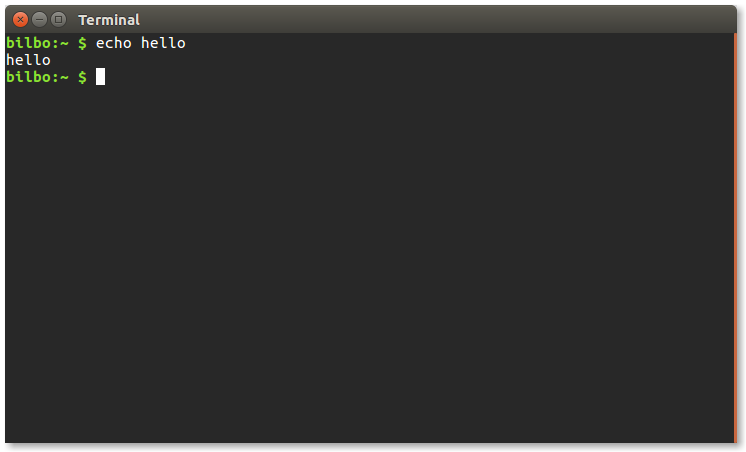

# interminal

`interminal` is a utility for launching a graphical terminal emulator and
running a command. It has the same behaviour as if you had opened the terminal
and typed the command yourself, including history, respecting shell aliases
etc. It is tested on Linux, possibly could work on macOS, and is not
compatible with Windows.


  * [Installation](#installation)
  * [Introduction](#introduction)
  * [Usage](#usage)
  * [Notes](#notes)
  * [Sublime extension example](#sublime-extension-example)


## Installation

to install `interminal`, run:

```
$ sudo pip3 install interminal
```

or to install from source:

```
$ sudo python3 setup.py install
```

## Introduction

`interminal` is mostly useful for things like making an external tool for your
text editor, or making a launcher for a terminal program, or things like that.
For example, you might want to run the command `python3 my_script.py` whenever
you press a certain keyboard shortcut in your text editor whilst you've got
the file `my_script.py` open. It's easy to make an extension to do this in,
for example, Sublime Text 3, but the output will be shown in a panel at the
bottom of Sublime's GUI. Sublime's GUI is not a terminal emulator, it does not
give you the power to re-run the command with different arguments, inspect
output files, etc. Sometimes what you really want is for your favourite
terminal emulator to be a keystroke away.

You'd think that would be easy, right? All terminal emulators have command
line options for telling them what command to run — can't we just use those?
Unfortunately it's not that simple. The following command:

```
$ gnome-terminal -x python3 my_script.py
```

has a few problems. One, it closes the terminal as soon as the command exits,
preventing you from seeing its output. Secondly, the script is not necessarily
run from within a shell (whether or not it does seems to vary by terminal
emulator and the current phase of the moon), meaning any environment variables
you've set in your `.bashrc` or aliases etc may not be available. If you want
your commands to be run in a 'normal' environment, you need to run a shell in
the terminal first, and tell the shell to run your command. Then you have to
start another shell to ensure the terminal emulator stays open:

```
$ gnome-terminal -x bash -c "python3 my_script.py; bash"
```

This is almost good enough. It doesn't add the command to your shell history,
but it's basically what we want. But if you need to escape some characters in
your command, you are two-layers deep in "passing commands to other commands"
— the quoting is going to get out of control fast. And for reasons I can't
grasp, I can't get the above to work with some terminal emulators.

Ideally we want something that will work with the minimum quoting, and that
emulates exactly what would happen if you typed something into a terminal
yourself. That's where `interminal` comes in.


## Usage

To run a command such as `echo hello` in a terminal emulator, run the command:

```
$ interminal echo hello
```

This will launch a new terminal emulator, run the command `echo hello`, and
then leave you at an interactive prompt, with the command `echo hello` in your
shell history, exactly as if you had launched the terminal emulator and typed
it yourself. In fact, `interminal` works by injecting the command into the
input of a pseudoterminal connected to your shell, and so as far as that shell
is concerned, you *did* type it in. In this way, `interminal` can respect
whatever crazy hacks you have decided to apply to your shell — by just typing
things into a terminal the same as a human would.



If you have something more complex, you can instead do:

```
$ interminal --script 'du -hs $HOME/* | sort -hr; echo hello'
```

This allows you to include things that will be interpreted by the shell in the
launched terminal emulator (but not by the shell, if any, from which you are
executing the above command).


## Notes

Which terminal emulator to launch is guessed based on the `XDG_DESKTOP`
environment variable — the default terminal emulator for the desktop
environment is used. If you want to use a different one, you can call
interminal like this, using the terminology terminal emulator as an example:

```
$ terminology -e inshell --script 'du -hs $HOME/* | sort -hr; echo hello'
```

`interminal` is actually just a very short script that replaces its own
process with the terminal emulator running the `inshell` script, which is also
part of this package. So you can call `inshell` yourself as above to control
which terminal to launch. If this sounds like it defeats the purpose of this
project, it doesn't — inserting the command into a shell that otherwise
behaves like an ordinary interactive shell is the tricky bit.


If you are running the `interminal` command from a shell, then you must make
sure that its arguments, *after being interpreted by that shell* are what you
want to run in the interactive shell that is started in the terminal emulator.
For example, if you run:

```
$ interminal echo $PATH
```

then `$PATH` will be expanded *prior* to `interminal` being called. This might
be undesirable if, for example, the shell you are running `interminal` from is
dash, and your `$SHELL` environment variable (which is what `interminal`
will run) is /bin/bash. The current shell won't have run your `.bashrc` and so
might not have any additions you have made there to your `$PATH` variable. So
as a general rule, in these cases you should do:

```
$ interminal --script 'echo $PATH'
```

Of course if you want to have single quotes in your command, the required
escape sequences can get unwieldy:

```
$ interminal --script 'echo $PATH > '"'"'my file with spaces'"'"''
```

(this will run `echo $PATH > 'my file with spaces'`)

Hopefully, you are using `interminal` from an environment that lets you pass
in command line arguments that are not interpreted by a shell, but instead
are passed directly to the `exec()` system call, in which case the above
quoting is unnecessary. For example, in Python, this is fine:

```python
import subprocess
subprocess.Popen(["interminal", "--script", "echo $PATH > 'my file with spaces'"])
```

In fact, you can have an arbitrarily long multi-line shell script as that
final argument, it will be executed as-is.

The following is fine too, for the case where you are not using any features
of the shell and just want to run a single command:

```python
import subprocess
subprocess.Popen(["interminal", "python3", "/path/to/my script with spaces.py"])
```
No quoting is neccesary at all in this case.

But if you have to pass something to a shell, and you don't know in advance
what the arguments are, you should try to quote them programatically to ensure
you get the quoting right:

```python
import shlex
import os


# If you have a command using shell features:
args = ["interminal", "--script", "echo $PATH > 'my file with spaces'"]

# or, when not using shell features:
# args = ["interminal", "python3", "/path/to/my script with spaces.py"]

# Create a single, appropriately quoted command from the arguments:
command = ' '.join(shlex.quote(arg) for arg in args)

# Then pass the single command to whatever shell will interpret it:
os.system(command)
```

## Sublime extension example

Here's how I use `interminal` to make Sublime Text 3 run Python. This requires
an extension file to be placed in `~/.config/sublime-text-3/Packages/User/`:

```python

# ~/.config/sublime-text-3/Packages/User/python_interminal.py

import os
import subprocess
import sublime_plugin


class WindowCommand(sublime_plugin.WindowCommand):

    @property
    def current_file(self):
        return os.path.abspath(self.window.active_view().file_name())

    @property
    def current_file_basename(self):
        return os.path.basename(self.current_file)

    @property
    def current_folder(self):
        return os.path.dirname(self.current_file)

    def save(self):
        self.window.active_view().run_command('save')


class PythonInterminalCommand(WindowCommand):
    def run(self, index=None):
        self.save()
        subprocess.Popen(['interminal', 'python3', '-i', self.current_file_basename],
                         cwd=self.current_folder)

```

And then it requires an addition to the keybindings file:
```
[

    ...

    { "keys": ["f5"], "command": "python_interminal" },

    ...

]
```

Then when you press `F5`:


Note that it doesn't matter what the extension file is called, the keybinding
finds the right command to run based on a naming convention for the class:
`foo_bar_baz` means it will look for a class called `FooBarBazCommand`.

I prefer `python3 -i` but you can of course modify this to whatever you like.

In particular with this command, running commands through an actual shell is
useful for because I have an alias such that `python3` actually calls
`~/anaconda3/bin/python`, a newer version of Python than the system Python. If
I change the alias, I won't have to change my Sublime extension - I only have
to make sure the shell does what I want, and then anything launched via
`interminal` will respect that.
